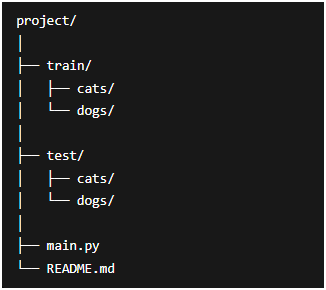

# Cats vs Dogs Image Classification using CNN
A deep learning project built with TensorFlow and Keras to classify images of cats and dogs using a Convolutional Neural Network (CNN).

## Description
This project trains a CNN model on image data to distinguish between cats and dogs.
It uses image preprocessing, data augmentation, and multiple convolutional layers to improve classification performance.

## Features
- Image classification using CNN
- Data augmentation for better generalization
- Binary classification (cat vs dog)
- Model saving for future inference
- Built with TensorFlow/Keras

## Technologies Used
- Python
- TensorFlow
- Keras
- NumPy
- ImageDataGenerator

## Dataset
The model is trained on a dataset of cat and dog images. Ensure images are labeled appropriately.

## Model Architechture

The CNN consists of:

- Conv2D + MaxPooling layers
- ReLU activation
- Flatten layer
- Dense fully connected layer
- Sigmoid output layer for binary classification

## Data Augmentation

raining images are augmented using:

- Rotation
- Zoom
- Horizontal flipping
- Rescaling

This helps reduce overfitting and improves model robustness.

## Contributions

Contributions are welcome!
Feel free to fork the repository and submit pull requests.